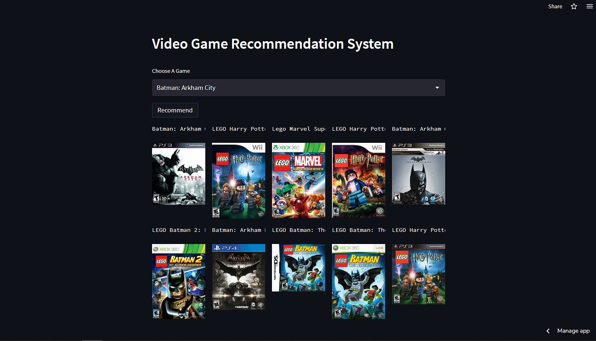

# Game Recommendation System

### Say Hello to ...
**A video game recommendation system created for every gamer. Finished a game but left wanting for more? Find more!!!**  \
This system was created with Content based filtering. This filtering technique uses similarities between data points to find the closest, best possible recommnedations. It is one of the two major methods used widely.  \
It uses a Machine Learning technique called **Clustering**.  \
Specifically, it uses clustering based on K Nearest Neighbours where the system finds 'More Like This' data points based on available features.

 

### Data
The system is not using a readily available dataset, but instead was collected from the very popular VGChartz!  \
Using Python's BeautifulSoup package, the data was scraped and transformed into a dataframe, then to a csv file. See `data/scraper.py`  \
After which, it underwent major cleaning and preprocessing using a Pandas pipeline, which then gives us the proper data that is needed. See `data/pipeline.py`  

### Next up, the Model ...
The data goes through some more Feature engineering before it is ready for Machine Learning. The Features are label-encoded and prepared for modelling.  \
Finally, using Scikit-Learn's `NearestNeighbours` algorithm, we fit the data to the clustering model, which is now ready to recommend!. See `model/model.py`

### Deployment
This system was deployed on the very friendly-neighbourhood web app service, **Streamlit**!!!

### Future Work
* Adding more features to improve the quality of recommendations
* Add the dimension of users, which strengthens recommendation systems by many folds
* Introduce Collaborative Filtering

#### Note
This system is **not** perfect. The recommendations may seem out of sense sometimes, but it is subject to the availability and quality of the data!

